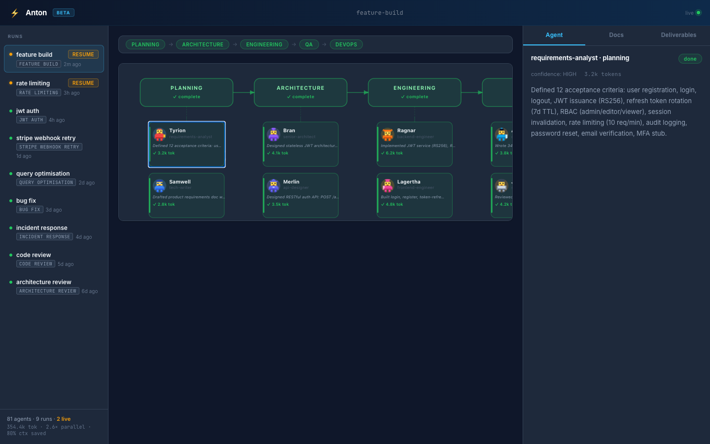

# Anton

**I gave Claude Code a team of 12 AI specialists.**

One slash command. They work in parallel. You watch them live in your browser.

```
/team-dispatch build user auth with JWT and refresh tokens
```


> No new API key. No venv. No LangChain. Runs inside the Claude Code subscription you already have.

## Install

```bash
curl -fsSL https://raw.githubusercontent.com/kabirnarang39/claude-team/main/install.sh | sh
```

[](https://github.com/kabirnarang39/claude-team/actions/workflows/ci.yml)
[](https://go.dev)
[](LICENSE)
[](https://github.com/kabirnarang39/claude-team/releases)
[](https://goreportcard.com/report/github.com/kabirnarang39/claude-team)
[](https://codecov.io/gh/kabirnarang39/claude-team)


## Quick Start

```bash
# 1. Start Anton in your project directory
anton

# 2. Open Claude Code in the same directory
claude

# 3. Dispatch a task
/team-dispatch build user auth with JWT and refresh tokens
```

Open `http://localhost:3000` — watch 12 specialists work through planning, architecture, engineering, QA, and DevOps. Live.

> **First time?** Run `anton --check` to confirm setup. Run `anton --demo` to preview the dashboard with a sample completed run — no Claude Code needed. **Browser dispatch:** Enter a task at `http://localhost:3000`, click ▶ Dispatch, paste into Claude Code.

---

## ⚡ Speed — Parallel by default

Claude Code runs one agent at a time. Anton runs up to 12 specialists per task.

While your architect writes the ADR, three engineers tackle backend, frontend, and database in parallel. Sequential phases run in series; parallel phases run concurrently. A task that would take hours of sequential prompting completes in minutes.

```
Phase 1 (Planning):     requirements-analyst → tech-writer
Phase 2 (Architecture): senior-architect → api-designer
Phase 3 (Engineering):  backend + frontend + dba (parallel)
Phase 4 (QA):           qa-engineer → security-reviewer → e2e-tester
Phase 5 (DevOps):       code-reviewer → devops-engineer
```

Anton also evaluates which agents are actually needed before dispatching. Pure backend change? `frontend-engineer` and `dba` skip automatically. Architecture-only phase? `backend-engineer` stays idle. The coordinator writes an agent plan, marks skipped agents `⊘` in the dashboard, and dispatches only what the task actually requires.

## 👁 Observability — Watch them work

Every agent's reasoning is visible in real time. The live DAG shows all phases and agents — click any node to open the inspector panel. Three tabs: **Agent** (full output + confidence score + token count), **Docs** (reference material the agent read), **Deliverables** (output files produced so far). Nothing is hidden, nothing is a black box.



All outputs land in `.claude-team/runs/<run_id>/` as plain Markdown files — yours to read, edit, and version-control.

Each agent has a unique persona — pixel art characters (Ragnar the backend engineer, Jon Snow the security reviewer, Floki the devops engineer) so you can track who's doing what at a glance. Skipped agents appear as `⊘` in the DAG — you see exactly which specialists ran and which were deemed unnecessary for your task.

## 🧠 Cost-Smart Model Routing

Anton picks the cheapest model that can handle each job — you don't pay opus prices for boilerplate.

| Tier | Model | Assigned to |
|------|-------|-------------|
| Haiku | `claude-haiku-4-5-20251001` | tech-writer, requirements extraction, file formatting, boilerplate |
| Sonnet | `claude-sonnet-4-6` | backend-engineer, frontend-engineer, dba, qa-engineer, e2e-tester, devops-engineer, performance-engineer |
| Opus | `claude-opus-4-8` | senior-architect, api-designer, security-reviewer, code-reviewer, debugger, incident triage |

If a Sonnet-tier agent returns `DONE_WITH_CONCERNS` or `BLOCKED`, Anton automatically re-dispatches on Opus before surfacing to you.

Token usage per agent is read directly from session transcripts — actual input + output tokens, not estimates — and displayed in the inspector.

## 🔍 Review Gates — Human and Automated

Anton pauses twice in the `feature-build` workflow and shows you what it produced before continuing.

**Gate 1 — Plan Review** (after planning, before architecture)

Anton prints the full PRD and waits:
```
── PLAN REVIEW ──────────────────────────────────────────
Review the PRD above before architecture design begins.

Type  approved              to proceed.
Type  rejected: <feedback>  to redo planning with your feedback.
─────────────────────────────────────────────────────────
```

**Gate 2 — Task Review** (after architecture, before engineering)

Anton prints the ADR and OpenAPI spec and waits for the same prompt. Reject with feedback → re-runs the phase with your notes appended. Loop until approved.

Both gates write to the dashboard and SQLite so review state survives restarts.

**Automated phase review** runs after every phase completes, before the coordinator reports DONE. It checks outputs against a checklist — ADR has a Decision section, implementation has tests, no acceptance criterion left unaddressed. Failing criterion → re-dispatches the responsible agent with specific feedback. If retries exhaust, it escalates to you. You only get interrupted when the automation can't resolve it.

## ⏸ Resume Interrupted Runs

Anton checkpoints after every phase. If your session crashes or you close Claude Code mid-run:

```bash
/team-resume
```

Anton reads `.claude-team/runs/<run_id>/checkpoint.json`, skips completed phases, and resumes from where it stopped — including partially-completed phases (only runs agents not already finished).

## 🧩 Simplicity — Nothing new to install

| What you need | What you don't need |
|--------------|-------------------|
| Claude Code (you have it) | New API key |
| Node.js 20+ | LangChain / CrewAI |
| Python 3 (checkpoint writes) | New subscription |
| Anton (one curl install) | pip / venv / virtualenv |

The workflows are plain YAML. The agent roles are plain Markdown. Read them, fork them, make them yours.

---

## What You Get

Anton agents produce **structured analysis and planning outputs** — every file lands in `.claude-team/runs/<run_id>/` and is readable in the dashboard.

| Agent | Produces | Example |
|-------|----------|---------|
| `requirements-analyst` | `acceptance-criteria.md` | Given/When/Then criteria, edge cases, user stories |
| `tech-writer` | `prd.md` | Product requirements doc, scope, open questions |
| `senior-architect` | `adr.md` | JWT vs sessions decision, Redis architecture |
| `api-designer` | `openapi.yaml` | 5 endpoints, request/response schemas (OpenAPI 3.1) |
| `backend-engineer` | `implementation/` | Server code, tests, key decisions |
| `frontend-engineer` | `implementation/` | UI components, auth flow, state handling |
| `dba` | `implementation/migrations/` | Schema, indices, forward + rollback migrations |
| `qa-engineer` | `qa-report.md` | Test cases, coverage plan, integration scenarios |
| `security-reviewer` | `security-report.md` | OWASP checklist, findings with CVE refs, mitigations |
| `e2e-tester` | `implementation/tests/e2e/` | E2E test files, curl regression tests |
| `code-reviewer` | `review-report.md` | Code quality findings, architecture conformance |
| `devops-engineer` | `implementation/` | Dockerfile, CI/CD pipeline, Helm chart |

See [`docs/examples/feature-build-user-auth/`](docs/examples/feature-build-user-auth/) for real sample outputs — all 12 agents, same task.

---

## The Agent Roles

Every agent is a plain Markdown system prompt in [`roles/`](roles/). Here's what they actually say:

**`roles/security-reviewer.md`** (excerpt):
```
Audit code for OWASP Top 10 vulnerabilities. Never guess — search CVEs and
current OWASP docs. Halt the entire phase on critical findings.

Approach:
1. Read all implementation files (filesystem MCP)
2. Search OWASP Top 10 current list (brave-search: "OWASP Top 10 site:owasp.org")
3. Check each file for: injection, broken auth, XSS, IDOR, security misconfiguration
4. For each finding: severity, file, line, description, fix, OWASP/CVE reference
```

**`roles/senior-architect.md`** (excerpt):
```
You design systems. You do NOT write application code or tests.
Never hallucinate API signatures or package names — if unsure, search before stating.
Before recommending any library: check its current maintenance status.
Read existing code structure before proposing architecture.
```

Read and fork the full prompts in [`roles/`](roles/). Add your own specialist in under 10 minutes.

---

## Workflows

| Workflow | What it does | Phases | Agents |
|----------|-------------|--------|--------|
| `feature-build` | Full cycle: planning → architecture → engineering → QA → DevOps | 5 | 12 |
| `code-review` | Parallel review (arch + security + quality) → verdict summary | 2 | 4 |
| `bug-fix` | Triage → parallel fix → verify | 3 | 4 |
| `incident-response` | RCA → hotfix → verify → post-mortem | 4 | 5 |
| `architecture-review` | Parallel review (arch + security) → ADR | 2 | 2 |

Each workflow is a plain YAML file in [`workflows/`](workflows/) — [add your own](#add-a-workflow) in under 5 minutes.

---

## Why Anton?

| Metric | Anton | Solo Claude session |
|--------|-------|---------------------|
| Context per agent | starts fresh (~2–4k tokens) | grows with every turn (30k+ by turn 10) |
| Parallel speedup | 3× on parallel phases | 1× — always sequential |
| Response verbosity | removes filler vocabulary from agent responses | baseline |
| Specialists per task | 2–12 depending on workflow | 1 |
| Context isolation | each sub-agent sees only its role | shared, polluted context |
| Human review gates | plan + architecture approval before engineers start | none |
| Smart agent planning | skips unneeded agents per task automatically | dispatches all |
| Resume on crash | checkpoint per phase, `/team-resume` to continue | start over |
| Tool integrations | 25 MCPs — Jira, Slack, GitHub, Postgres, Sentry… | whatever's in your session |
| Model cost routing | haiku → sonnet → opus by task complexity | 1 model for everything |

> **Context isolation math:** In a solo 10-agent session, context grows as `N(N+1)/2` turns of history. Anton sub-agents each start fresh — `5.5×` less context overhead at 10 agents (theoretical — assumes equal context per turn; actual savings depend on context window usage per agent).

### Anton vs. other multi-agent frameworks

| | Anton | Claude Squad | CrewAI | AutoGen | MetaGPT |
|--|-------|-------------|--------|---------|---------|
| Runs inside Claude Code | ✅ | ✅ | ❌ | ❌ | ❌ |
| Uses your Claude Code subscription | ✅ | ✅ | ❌ | ❌ | ❌ |
| No new API key, no venv, no LangChain | ✅ | ✅ | ❌ | ❌ | ❌ |
| Live browser dashboard | ✅ | ❌ | ❌ | ❌ | ❌ |
| Workflows in plain YAML | ✅ | ❌ | ⚠️ code | ⚠️ code | ⚠️ code |
| Agent roles in plain Markdown | ✅ | ❌ | ⚠️ code | ⚠️ code | ⚠️ code |
| SQLite state (survives restarts) | ✅ | ❌ | ❌ | ❌ | ❌ |
| Human review gates | ✅ | ❌ | ❌ | ❌ | ❌ |
| Automated phase-review + retry | ✅ | ❌ | ❌ | ❌ | ❌ |
| Smart agent planning (skips unneeded) | ✅ | ❌ | ❌ | ❌ | ❌ |
| Run checkpoint + resume | ✅ | ❌ | ❌ | ❌ | ❌ |
| 25 built-in MCP integrations | ✅ | ❌ | ❌ | ❌ | ❌ |
| Cost-smart model routing | ✅ | ❌ | ❌ | ❌ | ❌ |
| Local / offline-first | ✅ | ✅ | ✅ | ✅ | ✅ |
| Open source | ✅ | ✅ | ✅ | ✅ | ✅ |

### Anton vs. Devin / Copilot Workspace

Anton doesn't try to replace your judgment or write code autonomously. Agents produce structured analysis, plans, and specifications — you review, decide, and implement. No surprise commits, no mystery diffs. You own the process.

---

## How It Works

```
You → /team-dispatch → Main Coordinator (your Claude Code session)
                              │
             ┌────────────────┼────────────────┐
             ▼                ▼                ▼
       Planning           Engineering       QA
       Coordinator        Coordinator       Coordinator
             │                │                │
       requirements-   senior-architect   qa-engineer
       analyst         api-designer       security-reviewer
       tech-writer     backend-engineer   e2e-tester
                       frontend-engineer
                       dba
                              │
                    MCP coordinator tool    ← agents report results
                              │
                       SQLite state.db      ← source of truth
                              │
                     Go HTTP + WebSocket    ← streams to browser
                              │
                    Browser dashboard       ← live agent tree
```

1. **You dispatch** a task with `/team-dispatch`.
2. **The coordinator** reads the workflow YAML and spins up sub-coordinators per phase.
3. **Each agent** reads its role prompt, does its work, and reports via the MCP tool.
4. **Anton's Go server** writes results to SQLite and streams updates over WebSocket.
5. **The dashboard** shows live progress — click any agent node to open the inspector (output · docs · deliverables).

---

## 🔌 Integrations

Anton auto-registers tools from `mcp-registry.yaml` at startup. Agents use them during their phase — no extra config beyond setting the env var for the tools you want.

### Project Management

| Integration | What agents use it for | Env var |
|------------|----------------------|---------|
| **Jira / Confluence** (Atlassian Rovo) | Coordinator reads linked tickets and Confluence specs before dispatch; tech-writer can write PRDs to Confluence | *(browser auth — no token needed)* |
| **Linear** | Coordinator reads issue details, acceptance criteria, and linked specs | `LINEAR_API_KEY` |
| **Notion** | Read/write pages and databases | `NOTION_TOKEN` |
| **ClickUp** | Read tasks and goals | `CLICKUP_TOKEN` |

### Version Control

| Integration | What agents use it for | Env var |
|------------|----------------------|---------|
| **GitHub** | Read open issues, search code, check CI status during engineering phase | `GITHUB_TOKEN` |
| **GitLab** | Read MRs and pipelines | `GITLAB_TOKEN` |

### Design

| Integration | What agents use it for | Env var |
|------------|----------------------|---------|
| **Figma** | Frontend engineer reads component specs and design tokens | `FIGMA_TOKEN` |

### Databases

| Integration | What agents use it for | Env var |
|------------|----------------------|---------|
| **PostgreSQL** | DBA reads live schema before designing migrations | `DATABASE_URL` |
| **MySQL / MariaDB** | Same as Postgres | `MYSQL_URL` |
| **MongoDB** | DBA reads collections and aggregation patterns | `MONGODB_URI` |
| **Redis** | Backend engineer reads key patterns and TTL strategy | `REDIS_URL` |
| **Supabase** | DB + auth + storage + edge functions | `SUPABASE_URL`, `SUPABASE_KEY` |
| **SQLite** | Read local database files | `SQLITE_PATH` |

### Cloud & Deploy

| Integration | What agents use it for | Env var |
|------------|----------------------|---------|
| **Vercel** | DevOps reads deployment config, env vars, domains | `VERCEL_TOKEN` |
| **Cloudflare** | DevOps reads Workers, KV, D1, R2, DNS | `CLOUDFLARE_TOKEN` |
| **AWS** | DevOps reads S3, Lambda, EC2, CloudFormation | `AWS_ACCESS_KEY_ID`, `AWS_SECRET_ACCESS_KEY`, `AWS_REGION` |

### Testing & Browser

| Integration | What agents use it for | Env var |
|------------|----------------------|---------|
| **Playwright** | E2E tester runs browser automation and screenshots | *(no token)* |

### Observability

| Integration | What agents use it for | Env var |
|------------|----------------------|---------|
| **Sentry** | Security reviewer and debugger read error traces | `SENTRY_AUTH_TOKEN`, `SENTRY_ORG` |
| **Datadog** | Incident response reads metrics, logs, traces, monitors | `DD_API_KEY`, `DD_APP_KEY` |

### Files & Search

| Integration | What agents use it for | Env var |
|------------|----------------------|---------|
| **Filesystem** | All agents read project files — always active | *(no token)* |
| **Google Drive** | Tech writer reads Docs, Sheets, Slides | *(browser auth)* |
| **Brave Search** | All agents search docs and CVEs before stating facts | `BRAVE_API_KEY` |
| **Tavily** | AI-optimised search for RAG and doc lookup | `TAVILY_API_KEY` |

### Communication

| Integration | What agents use it for | Env var |
|------------|----------------------|---------|
| **Slack** | DevOps posts phase summaries to channels | `SLACK_BOT_TOKEN` |

### Containers

| Integration | What agents use it for | Env var |
|------------|----------------------|---------|
| **Docker** | DevOps manages containers and images | *(no token)* |

Set env vars before running `anton`. MCPs with missing env vars are skipped silently — the rest still work. To use a custom registry path: `anton -registry /path/to/mcp-registry.yaml`.

---

## Add a Workflow

Drop a `.yaml` file into `workflows/`. Anton picks it up immediately — no restart:

```yaml
name: my-workflow
description: What this workflow does

phases:
  - id: planning
    sequential:
      - requirements-analyst

  - id: engineering
    parallel:
      - backend-engineer
      - frontend-engineer

  - id: review
    sequential:
      - code-reviewer
      - security-reviewer
```

**`sequential`** — agents run one after another, each receiving the previous agent's output.
**`parallel`** — agents run concurrently in the same phase.

**Available roles:** `requirements-analyst` · `tech-writer` · `senior-architect` · `api-designer` · `backend-engineer` · `frontend-engineer` · `dba` · `qa-engineer` · `e2e-tester` · `security-reviewer` · `code-reviewer` · `debugger` · `devops-engineer` · `performance-engineer` · `mobile-engineer`

---

## Add a Role

Each role is a Markdown system prompt in `roles/`. To add a specialist:

1. Create `roles/my-specialist.md` — write the agent's purpose, what it receives, what it must output.
2. Follow `roles/_standards.md` — all agents report in the same JSON format so the dashboard can display them.
3. Reference your role name in any workflow YAML.

---

## CLI Reference

```
Usage of anton:
  -check
        Verify Claude Code, Node.js, and MCP setup — exit with pass/fail report
  -demo
        Pre-populate dashboard with a sample completed run (no Claude Code needed — great for previewing the UI)
  -port int
        HTTP port (default 3000)
  -registry string
        Path to mcp-registry.yaml (default "mcp-registry.yaml") — use a custom file to enable/disable specific MCPs
  -version
        Print version and exit
```

### Skills

| Skill | Description |
|-------|-------------|
| `/team-dispatch <task>` | Dispatch a new run. Accepts `--workflow <name>` to pick a non-default workflow. |
| `/team-status` | Print status of the latest run — phases, agents, confidence scores. |
| `/team-resume` | Resume a run from checkpoint. Use after a crash or interrupted session. |
| `/team-stop` | Stop the current run. |

---

## Requirements

- [Claude Code](https://claude.ai/download) — active subscription
- Node.js 20+
- Python 3 (used by coordinator for checkpoint writes — pre-installed on macOS and most Linux)
- Go 1.25+ (build from source only)

> **Platform support:** macOS arm64/amd64, Linux amd64. Linux arm64 (Graviton, Raspberry Pi) not yet supported — [upvote the issue](https://github.com/kabirnarang39/claude-team/issues).

---

## Build From Source

```bash
git clone https://github.com/kabirnarang39/claude-team
cd claude-team
cd mcp && npm install && cd ..
go run main.go
```

Run tests:

```bash
go test ./...
```

---

## Contributing

See [CONTRIBUTING.md](CONTRIBUTING.md) for dev setup, how to add workflows and roles, and PR guidelines.

## Security

See [SECURITY.md](SECURITY.md) for the vulnerability disclosure process.

## License

MIT — see [LICENSE](LICENSE).

---

> If Anton saves you time, ⭐ this repo — it helps others find it.
