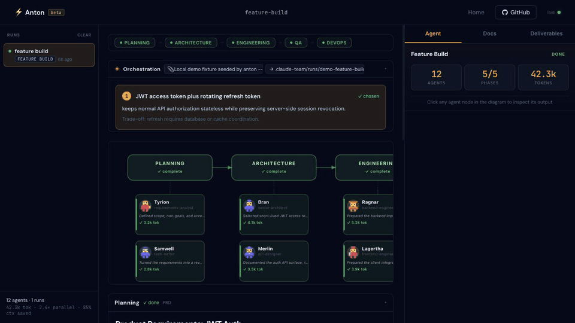
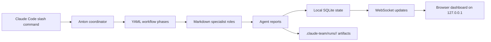
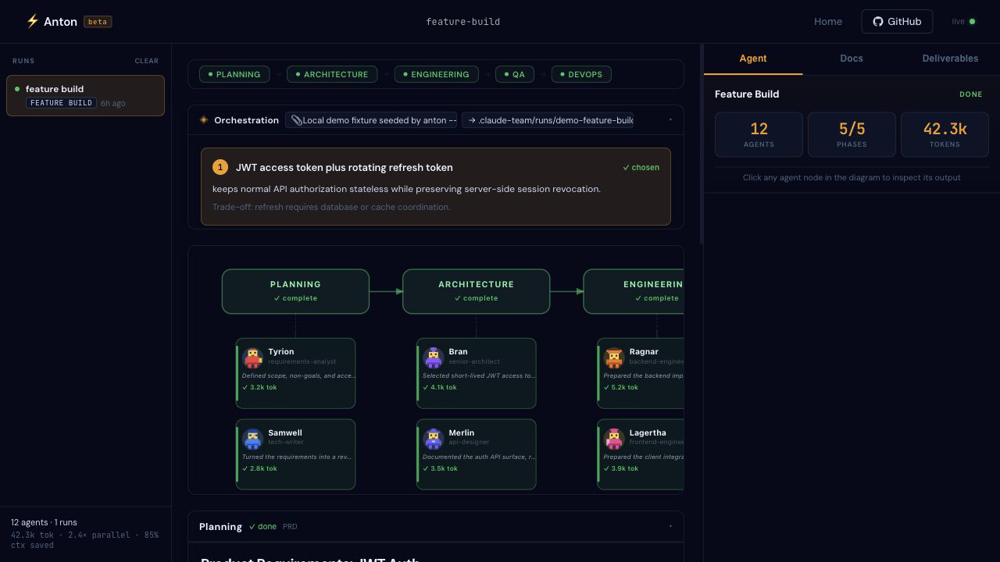
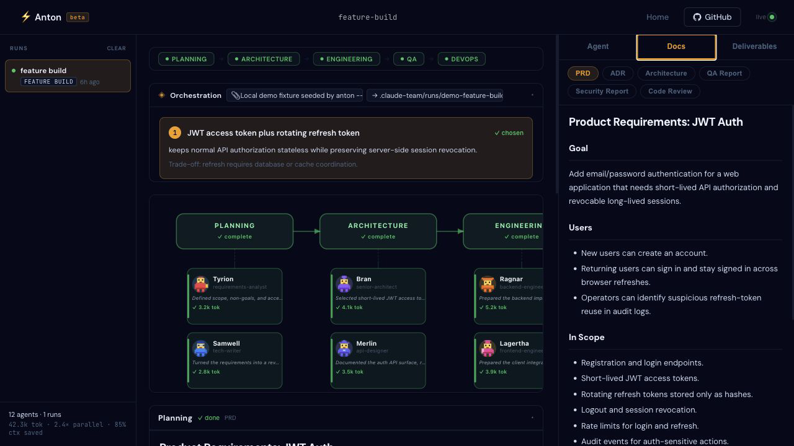
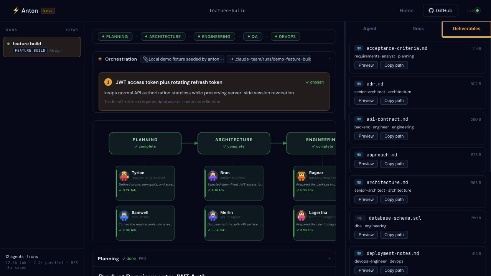
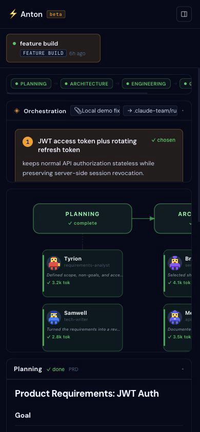

# Anton

**Claude Code-native workflow dashboard for structured, review-heavy local agent runs.**

Anton turns one Claude Code slash command into a coordinated local workflow: planning, architecture, engineering, QA/security, and DevOps. The coordinator runs inside your existing Claude Code session; the dashboard runs as a local Go server and streams agent progress from SQLite over WebSocket.

```text
/team-dispatch build user auth with JWT and refresh tokens
```

No new Anthropic API key. No Python framework. No LangChain. Optional MCP integrations can use their own provider tokens when you configure them.



- Claude Code-native: real runs use your existing Claude Code session, not direct Anthropic API calls.
- Inspectable by default: workflows are YAML, roles are Markdown, state is local SQLite.
- Review-heavy flow: the default feature-build workflow uses 12 specialist roles across 5 phases.

[](https://github.com/kabirnarang39/claude-team/actions/workflows/ci.yml)
[](https://go.dev)
[](LICENSE)
[](https://github.com/kabirnarang39/claude-team/releases)
[](https://goreportcard.com/report/github.com/kabirnarang39/claude-team)

## Who this is for

Use Anton when you already use Claude Code and want a repeatable way to split larger work into specialist passes: requirements, architecture, implementation, QA, security review, code review, and deployment notes.

Do not use Anton if you want a fully autonomous coding platform that commits and deploys without review. Anton is deliberately local-first and review-heavy: it produces structured artifacts and shows what each agent did so you can decide what to trust.

## Try it in five minutes

```bash
curl -fsSL https://raw.githubusercontent.com/kabirnarang39/claude-team/main/install.sh | bash
```

Then in any project:

```bash
anton --check
anton --demo
```

Open `http://localhost:3000` to inspect a sample completed run. To run a real workflow:

```bash
anton
claude
/team-dispatch build user auth with JWT and refresh tokens
```

The browser dashboard is for inspection and review. Dispatch currently starts from the Claude Code slash command.

## What works today

| Area | Current state |
| --- | --- |
| Default workflow | `feature-build`: 12 agents across 5 phases |
| Role library | 15 reusable role prompts in `roles/` |
| Dashboard | Local browser UI with run history, DAG, inspector, docs, and deliverables tabs |
| State | SQLite database in `.claude-team/state.db` with WebSocket updates |
| Resume | Checkpoint files and `/team-resume` for interrupted runs |
| Customization | Plain YAML workflows and Markdown role prompts |
| MCP presets | 7 npm-verified presets in `mcp-registry.yaml`; skipped if required env vars are unset |
| Distribution | GoReleaser binaries for macOS arm64/amd64 and Linux amd64 |

## Default workflow

`feature-build` runs these phases:

```text
Planning:      requirements-analyst -> tech-writer
Architecture: senior-architect -> api-designer
Engineering:  backend-engineer + frontend-engineer + dba
QA:           qa-engineer -> security-reviewer -> e2e-tester
DevOps:       code-reviewer -> devops-engineer
```

The dashboard pre-populates the expected agents, then replaces pending placeholders as agents report results.

## Why Anton?

Claude Code is great at deep solo work. Anton is for the moments when you want more structure around that work: explicit phases, specialist role prompts, saved artifacts, and a local dashboard you can inspect after the terminal scrollback has moved on.

Anton is also intentionally not a general agent framework. No LangChain, no AutoGen, no hosted control plane, and no separate orchestration API key. It is a small local layer around Claude Code: YAML workflows, Markdown roles, SQLite state, WebSocket updates, and a browser dashboard on localhost.

| Capability | Anton | Solo session |
| --- | --- | --- |
| Repeatable workflow | YAML phases | Manual prompting |
| Specialist prompts | 15 role prompts | One evolving conversation |
| Progress visibility | Live browser DAG | Terminal history |
| Artifact storage | Markdown/JSON in `.claude-team/runs/` | Conversation-dependent |
| Review checkpoints | Planning/architecture gates in coordinator prompts | Manual |
| Resume | Checkpoint-aware `/team-resume` | Reconstruct manually |
| Integrations | Explicit MCP presets | Whatever your session already has |

The main win is not magic autonomy. It is making multi-step engineering work visible, inspectable, and repeatable.

## How it works



The short demo path is:

```text
/team-dispatch build user auth with JWT and refresh tokens
    -> dashboard shows phase and agent progress
    -> final docs and deliverables are saved under .claude-team/runs/<run_id>/
```

## Screenshots and demo proof

The screenshots below come from `anton --demo`, which seeds a local sample run so you can inspect the UI without spending Claude Code tokens. They are demo fixtures, not external user results.









Static examples live in [`docs/examples/`](docs/examples/):

- [`feature-build-jwt-auth`](docs/examples/feature-build-jwt-auth/) - planning, architecture, QA, and review artifacts for a JWT auth feature
- [`code-review-sample`](docs/examples/code-review-sample/) - a compact multi-agent review output
- [`bug-fix-failing-test`](docs/examples/bug-fix-failing-test/) - root cause, fix plan, and verification notes for a failing test

To record a short launch demo, use [`docs/demo/recording-script.md`](docs/demo/recording-script.md). The script intentionally starts from `anton --demo` so the UI can be reviewed without spending Claude Code tokens.

## Inspect the workflow

The default workflow is plain YAML:

```yaml
# workflows/feature-build.yaml
phases:
  - id: planning
    sequential:
      - requirements-analyst
      - tech-writer
  - id: architecture
    sequential:
      - senior-architect
      - api-designer
  - id: engineering
    parallel:
      - backend-engineer
      - frontend-engineer
      - dba
  - id: qa
    sequential:
      - qa-engineer
      - security-reviewer
      - e2e-tester
  - id: devops
    sequential:
      - code-reviewer
      - devops-engineer
```

Roles are Markdown prompts. For example, [`roles/security-reviewer.md`](roles/security-reviewer.md) requires OWASP/CVE citations, exact file references for findings, and a coverage attestation before the role reports done.

## Verified MCP presets

Anton ships a small default registry of npm-verified MCP packages. Entries with missing required env vars are skipped when Anton writes `.claude/settings.json`.

| Name | Package | Required env |
| --- | --- | --- |
| `filesystem` | `@modelcontextprotocol/server-filesystem` | none |
| `brave-search` | `@modelcontextprotocol/server-brave-search` | `BRAVE_API_KEY` |
| `github` | `@modelcontextprotocol/server-github` | `GITHUB_PERSONAL_ACCESS_TOKEN` |
| `gitlab` | `@modelcontextprotocol/server-gitlab` | `GITLAB_PERSONAL_ACCESS_TOKEN` |
| `postgres` | `@modelcontextprotocol/server-postgres` | `DATABASE_URL` |
| `playwright` | `@playwright/mcp` | none |
| `slack` | `@modelcontextprotocol/server-slack` | `SLACK_BOT_TOKEN`, `SLACK_TEAM_ID` |

Use a custom registry with:

```bash
anton -registry /path/to/mcp-registry.yaml
```

Run manual registry validation with:

```bash
node scripts/validate-mcp-registry.mjs
```

## Install and release assets

The installer fetches the latest GitHub release and selects the matching binary for your platform:

| Platform | Release asset |
| --- | --- |
| macOS Apple Silicon | `anton-darwin-arm64` |
| macOS Intel | `anton-darwin-amd64` |
| Linux amd64 | `anton-linux-amd64` |

The `v1.4.5` release includes those three binaries plus `checksums.txt`.

## Files Anton writes

Install writes:

```text
~/.local/bin/anton
~/.claude/skills/team-dispatch/
~/.claude/skills/team-resume/
~/.claude/skills/team-status/
~/.claude/skills/team-stop/
~/.claude/anton-mcp/
~/.claude/anton/
```

Running `anton` inside a project writes:

```text
<project>/.claude/settings.json
<project>/.claude-team/state.db
<project>/.claude-team/pending-task.md
<project>/.claude-team/runs/<run_id>/
<project>/.claude-team/uploads/
<project>/.claude-team/workflows/
```

To remove project-local Anton state from a repo:

```bash
rm -rf .claude-team
```

Remove the Anton entry from `.claude/settings.json` if you also want to unregister the project MCP server.

Uninstall:

```bash
curl -fsSL https://raw.githubusercontent.com/kabirnarang39/claude-team/main/install.sh | bash -s -- --uninstall
```

Project-local `.claude/settings.json` and `.claude-team/` data are not removed by uninstall.

## What Anton does not do

- It does not replace Claude Code.
- It does not call Anthropic APIs directly.
- It does not run a hosted control plane.
- It does not guarantee correct code, passing tests, or safe deployments.
- It does not make benchmark or adoption claims.
- It does not expose the dashboard beyond `127.0.0.1` by default.

## Known limitations

- Claude Code is required for real runs. `anton --demo` previews the dashboard only.
- Anton is local-only and binds to `127.0.0.1`; do not expose it to the public internet.
- The default installer supports macOS arm64/amd64 and Linux amd64.
- Parallelism depends on Claude Code behavior and your machine/session; there are no published speed benchmarks yet.
- MCP packages change. The bundled registry is intentionally small and verified; add extra integrations through a custom registry.
- The dashboard shows agent outputs and files, but Anton does not guarantee code correctness. You still review and run tests.

## Project layout

```text
main.go                  Go entrypoint, embedded UI, setup checks
internal/api/            HTTP handlers and WebSocket hub
internal/store/          SQLite store, run state, stats
internal/workflow/       Workflow YAML parser
internal/mcp/            MCP registry and Claude settings writer
mcp/team-coordinator.js  Stdio MCP bridge used by agents
workflows/               Built-in workflow YAML files
roles/                   Specialist role prompts
skills/                  Claude Code slash-command skills
ui/                      Vanilla JS dashboard
docs/examples/           Inspectable sample outputs
docs/launch/             Launch copy and maintainer responses
```

## Build from source

```bash
git clone https://github.com/kabirnarang39/claude-team
cd claude-team
cd mcp && npm ci --omit=dev && cd ..
go run main.go --demo
```

Run checks:

```bash
go test -race -coverprofile=/tmp/anton-coverage.out -covermode=atomic ./...
go vet ./...
node scripts/validate-mcp-registry.mjs
```

## Add a workflow

Drop a `.yaml` file into `workflows/`:

```yaml
name: my-workflow
description: What this workflow does

phases:
  - id: planning
    sequential:
      - requirements-analyst

  - id: engineering
    parallel:
      - backend-engineer
      - frontend-engineer

  - id: review
    sequential:
      - code-reviewer
      - security-reviewer
```

Sequential agents run one after another. Parallel agents run in the same phase.

## Contributing

See [CONTRIBUTING.md](CONTRIBUTING.md). Please keep the core stack simple: Go, SQLite, Node for the MCP bridge, and vanilla JS for the dashboard.

## Security

See [SECURITY.md](SECURITY.md). Anton is intended for local developer machines only.

## License

MIT. See [LICENSE](LICENSE).
