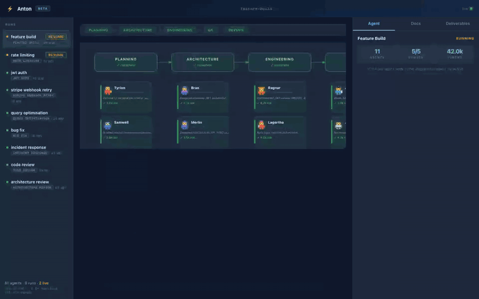

# Anton

**I gave Claude Code a team of 11 AI specialists.**

One slash command. They work in parallel. You watch them live in your browser.

```
/team-dispatch build user auth with JWT and refresh tokens
```

[](https://github.com/kabirnarang39/claude-team/actions/workflows/ci.yml)
[](https://go.dev)
[](LICENSE)
[](https://github.com/kabirnarang39/claude-team/releases)
[](https://goreportcard.com/report/github.com/kabirnarang39/claude-team)
[](https://codecov.io/gh/kabirnarang39/claude-team)




> No Python. No new API key. No venv. Runs inside the Claude Code subscription you already have.

---

## Install

```bash
curl -fsSL https://raw.githubusercontent.com/kabirnarang39/claude-team/main/install.sh | sh
```

## Quick Start

```bash
# 1. Start Anton in your project directory
anton

# 2. Open Claude Code in the same directory
claude

# 3. Dispatch a task
/team-dispatch build user auth with JWT and refresh tokens
```

Open `http://localhost:3000` — watch 11 specialists work through planning, architecture, engineering, QA, and DevOps. Live.

> **First time?** Run `anton --check` to confirm setup. Run `anton --demo` to preview the dashboard with a sample completed run — no Claude Code needed. **Browser dispatch:** Enter a task at `http://localhost:3000`, click ▶ Dispatch, paste into Claude Code.

---

## ⚡ Speed — Parallel by default

Claude Code runs one agent at a time. Anton runs 11 simultaneously.

While your architect writes the ADR, three engineers tackle backend, frontend, and database in parallel. While QA writes test cases, security runs the OWASP checklist. A task that would take hours of sequential prompting completes in minutes.

```
Phase 1 (Planning):     requirements-analyst → tech-writer
Phase 2 (Architecture): senior-architect + api-designer (parallel)
Phase 3 (Engineering):  backend + frontend + dba (parallel)
Phase 4 (QA):           qa-engineer + security-reviewer + e2e-tester (parallel)
Phase 5 (DevOps):       devops-engineer
```

## 👁 Observability — Watch them work

Every agent's reasoning is visible in real time. Click any node in the dashboard to read its full output. Nothing is hidden, nothing is a black box.

All outputs land in `.claude-team/runs/<run_id>/` as plain Markdown files — yours to read, edit, and version-control.

## 🧩 Simplicity — Nothing new to install

| What you need | What you don't need |
|--------------|-------------------|
| Claude Code (you have it) | Python / pip / venv |
| Node.js 20+ | New API key |
| Anton (one curl install) | LangChain / CrewAI |
| | New subscription |

The workflows are plain YAML. The agent roles are plain Markdown. Read them, fork them, make them yours.

---

## What You Get

Anton agents produce **structured analysis and planning outputs** — every file lands in `.claude-team/runs/<run_id>/` and is readable in the dashboard.

| Agent | Produces | Example |
|-------|----------|---------|
| `requirements-analyst` | `acceptance-criteria.md` | 12 requirements, edge cases, user stories |
| `tech-writer` | `prd.md` | Product requirements doc, scope, open questions |
| `senior-architect` | `adr.md` | JWT vs sessions decision, Redis architecture |
| `api-designer` | `openapi.yaml` | 5 endpoints, request/response schemas |
| `backend-engineer` | `backend-report.md` | Implementation plan, key decisions, risks |
| `frontend-engineer` | `frontend-report.md` | Component structure, auth flow, state handling |
| `dba` | `dba-report.md` | Schema design, indices, migration strategy |
| `qa-engineer` | `qa-report.md` | Test cases, coverage plan, integration scenarios |
| `security-reviewer` | `security-report.md` | OWASP checklist, findings, mitigations |
| `e2e-tester` | `e2e-report.md` | Playwright test plan, edge cases |
| `devops-engineer` | `devops-report.md` | Dockerfile, CI/CD, Helm chart plan |

See [`docs/examples/feature-build-user-auth/`](docs/examples/feature-build-user-auth/) for real sample outputs — all 11 agents, same task.

---

## The Agent Roles

Every agent is a plain Markdown system prompt in [`roles/`](roles/). Here's what they actually say:

**`roles/security-reviewer.md`** (excerpt):
```
Audit code for OWASP Top 10 vulnerabilities. Never guess — search CVEs and
current OWASP docs. Halt the entire phase on critical findings.

Approach:
1. Read all implementation files (filesystem MCP)
2. Search OWASP Top 10 current list (brave-search: "OWASP Top 10 site:owasp.org")
3. Check each file for: injection, broken auth, XSS, IDOR, security misconfiguration
4. For each finding: severity, file, line, description, fix, OWASP/CVE reference
```

**`roles/senior-architect.md`** (excerpt):
```
You design systems. You do NOT write application code or tests.
Never hallucinate API signatures or package names — if unsure, search before stating.
Before recommending any library: check its current maintenance status.
Read existing code structure before proposing architecture.
```

Read and fork the full prompts in [`roles/`](roles/). Add your own specialist in under 10 minutes.

---

## Workflows

| Workflow | What it does | Phases | Agents |
|----------|-------------|--------|--------|
| `feature-build` | Full cycle: planning → architecture → engineering → QA → DevOps | 5 | 11 |
| `code-review` | Architecture + security + quality review in parallel | 1 | 3 |
| `bug-fix` | Root cause analysis → fix plan → verify | 2 | 3 |
| `incident-response` | Triage → hotfix → verify → post-mortem | 3 | 4 |
| `architecture-review` | Design doc review → ADR | 1 | 2 |

Each workflow is a plain YAML file in [`workflows/`](workflows/) — [add your own](#add-a-workflow) in under 5 minutes.

---

## Why Anton?

| Metric | Anton | Solo Claude session |
|--------|-------|---------------------|
| Context per agent | starts fresh (~2–4k tokens) | grows with every turn (30k+ by turn 10) |
| Parallel speedup | 3× on parallel phases | 1× — always sequential |
| Response verbosity | removes filler vocabulary from agent responses | baseline |
| Specialists per task | 7–12 | 1 |
| Context isolation | each sub-agent sees only its role | shared, polluted context |

> **Context isolation math:** In a solo 10-agent session, context grows as `N(N+1)/2` turns of history. Anton sub-agents each start fresh — `5.5×` less context overhead at 10 agents.

### Anton vs. other multi-agent frameworks

| | Anton | Claude Squad | CrewAI | AutoGen | MetaGPT |
|--|-------|-------------|--------|---------|---------|
| Runs inside Claude Code | ✅ | ✅ | ❌ | ❌ | ❌ |
| Uses your Claude Code subscription | ✅ | ✅ | ❌ | ❌ | ❌ |
| No Python, no venv, no LangChain | ✅ | ✅ | ❌ | ❌ | ❌ |
| Live browser dashboard | ✅ | ❌ | ❌ | ❌ | ❌ |
| Workflows in plain YAML | ✅ | ❌ | ⚠️ code | ⚠️ code | ⚠️ code |
| Agent roles in plain Markdown | ✅ | ❌ | ⚠️ code | ⚠️ code | ⚠️ code |
| SQLite state (survives restarts) | ✅ | ❌ | ❌ | ❌ | ❌ |
| Local / offline-first | ✅ | ✅ | ✅ | ✅ | ✅ |
| Open source | ✅ | ✅ | ✅ | ✅ | ✅ |

### Anton vs. Devin / Copilot Workspace

Anton doesn't try to replace your judgment or write code autonomously. Agents produce structured analysis, plans, and specifications — you review, decide, and implement. No surprise commits, no mystery diffs. You own the process.

---

## How It Works

```
You → /team-dispatch → Main Coordinator (your Claude Code session)
                              │
             ┌────────────────┼────────────────┐
             ▼                ▼                ▼
       Planning           Engineering       QA
       Coordinator        Coordinator       Coordinator
             │                │                │
       requirements-   senior-architect   qa-engineer
       analyst         api-designer       security-reviewer
       tech-writer     backend-engineer   e2e-tester
                       frontend-engineer
                       dba
                              │
                    MCP coordinator tool    ← agents report results
                              │
                       SQLite state.db      ← source of truth
                              │
                     Go HTTP + WebSocket    ← streams to browser
                              │
                    Browser dashboard       ← live agent tree
```

1. **You dispatch** a task with `/team-dispatch`.
2. **The coordinator** reads the workflow YAML and spins up sub-coordinators per phase.
3. **Each agent** reads its role prompt, does its work, and reports via the MCP tool.
4. **Anton's Go server** writes results to SQLite and streams updates over WebSocket.
5. **The dashboard** shows live progress — click any agent to read its full output.

---

## Add a Workflow

Drop a `.yaml` file into `workflows/`. Anton picks it up immediately — no restart:

```yaml
name: my-workflow
description: What this workflow does

phases:
  - id: planning
    sequential:
      - requirements-analyst

  - id: engineering
    parallel:
      - backend-engineer
      - frontend-engineer

  - id: review
    sequential:
      - code-reviewer
      - security-reviewer
```

**`sequential`** — agents run one after another, each receiving the previous agent's output.
**`parallel`** — agents run concurrently in the same phase.

**Available roles:** `requirements-analyst` · `tech-writer` · `senior-architect` · `api-designer` · `backend-engineer` · `frontend-engineer` · `dba` · `qa-engineer` · `e2e-tester` · `security-reviewer` · `code-reviewer` · `debugger` · `devops-engineer` · `performance-engineer` · `mobile-engineer`

---

## Add a Role

Each role is a Markdown system prompt in `roles/`. To add a specialist:

1. Create `roles/my-specialist.md` — write the agent's purpose, what it receives, what it must output.
2. Follow `roles/_standards.md` — all agents report in the same JSON format so the dashboard can display them.
3. Reference your role name in any workflow YAML.

---

## CLI Reference

```
Usage of anton:
  -check
        Check Anton setup and exit
  -demo
        Pre-populate dashboard with a sample completed run
  -port int
        HTTP port (default 3000)
  -registry string
        Path to mcp-registry.yaml (default "mcp-registry.yaml")
  -version
        Print version and exit
```

---

## Requirements

- [Claude Code](https://claude.ai/download) — active subscription
- Node.js 20+
- Go 1.25+ (build from source only)

> **Platform support:** macOS arm64/amd64, Linux amd64. Linux arm64 (Graviton, Raspberry Pi) not yet supported — [upvote the issue](https://github.com/kabirnarang39/claude-team/issues).

---

## Build From Source

```bash
git clone https://github.com/kabirnarang39/claude-team
cd claude-team
cd mcp && npm install && cd ..
go run main.go
```

Run tests:

```bash
go test ./...
```

---

## Contributing

See [CONTRIBUTING.md](CONTRIBUTING.md) for dev setup, how to add workflows and roles, and PR guidelines.

## Security

See [SECURITY.md](SECURITY.md) for the vulnerability disclosure process.

## License

MIT — see [LICENSE](LICENSE).

---

> If Anton saves you time, ⭐ this repo — it helps others find it.
